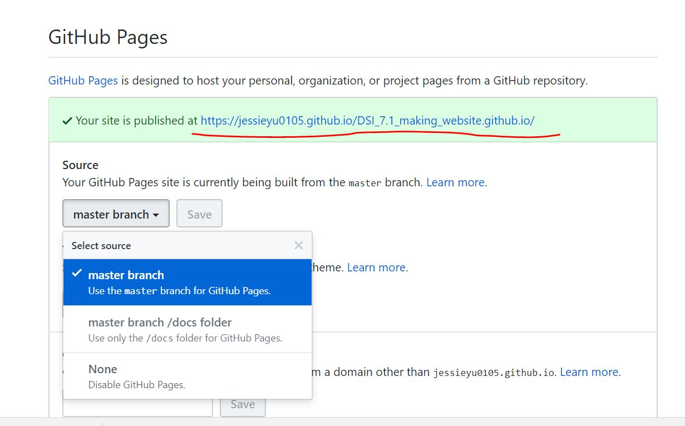

# 1. Create a repo on Github

* **Call it `website_name.github.io`**. 

My Repo: `jessieyu0105/DSI_7.1_making_website.github.io`

* **Create a local R project/directory for this repo**. 

# 2. Basic elements

Copy the files in `website_template` (D:/[CU_MS]/BIST 8105 - Data Science I/[R program]/[DSI]_7.1-Making websites.github.io/websote_template) to local directory

* `index.Rmd`: 主页

* `about.Rmd`: say a bit about the site -- **how it was made, where it's hosted, where the source code can be found**. Details about the **R package versions** that you used.

* `_site.yml`：令`index.Rmd`生成的`index.html`更像website的关键

# 3. Common contents

### Add links

* **在`about.Rmd`中编辑, knit生成`about.html`**

I like [to look for code on the internet](https://www.google.com).

I can link directly to my [about page](about.html).

### Add picture

* **在local directory中构建`images`文件夹，图存于其中**

Ain't she great:

### Add code

* **在local directory中构建`code.Rmd`, knit生成`code.html`**

My code page is [here](code.html).

### Add Icons

[icons come from font awesome](https://fontawesome.com/icons?from=io)

# 4. Build website & host on Github

* **R studio中`Build` button** (**Note：每次更新后都要`Rebuild Website`**)： 

* **Log in to GitHub, find the repo, and navigate to settings, 下拉，set the GitHub pages source to the master branch**, 网址就是绿色框中显示的那一串: [my website](https://jessieyu0105.github.io/DSI_7.1_making_website.github.io/)

### Change default theme 

[add a default theme to your YAML](dhttps://bootswatch.com/)

# Websites about projects
As noted, the preceding example is about a personal website but illustrates useful ideas. If you’re making a website about a data science project, I recommend including:

* A landing page giving a broad overview of the project
* A page (or pages) about the data wrangling, including the raw data if appropriate
* Separate pages for each distinct analysis, possibly organized using menus
* R and package versions used in the analyses

